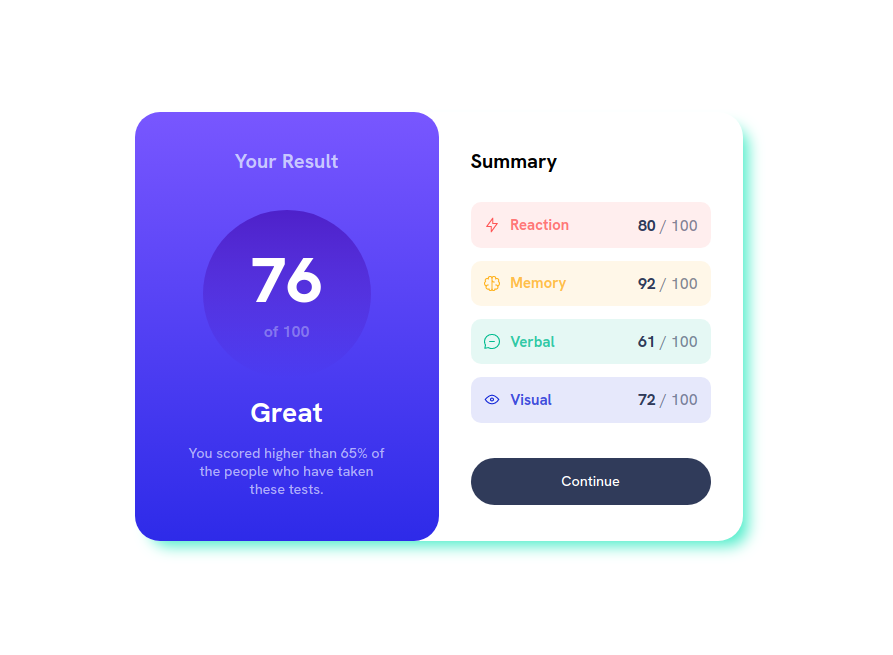

# Frontend Mentor - Results summary component solution

## Table of contents

- [Overview](#overview)
  - [Screenshot](#screenshot)
  - [Links](#links)
- [My process](#my-process)
  - [Built with](#built-with)
  - [What I learned](#what-i-learned)
  - [Continued development](#continued-development)
- [Author](#author)

---

## Overview

### Screenshot

### Links

- Solution URL: https://github.com/alexandre-joliet/FEM-results_summary_component
- Live Site URL: https://alexandre-joliet.github.io/FEM-results_summary_component/

---

## My process

Took me way more time than expexted! The design seems simple at first glance, and it is indeed, but it is made of many little parts that you need to take into account.

1. Analyse of the design schema to identify the different items and how to built the right elements in the HTML file
2. I tried to build the whole HTML file from the beginning by using the BEM methodology in one go and spent some time on it. I did quite well but nonetheless needed to correct or fix little things later on the project
3. Starting of building the style in CSS, from top to bottom
4. Polishing the desktop version
5. Building of the mobile version

### Built with

- Semantic HTML5 markup
- BEM methodology
- CSS custom properties
- Flexbox
- Desktop-first workflow

NB: no use of the JSON file for this V1. I will make a V2 with it later.

### What I learned

Gradient that I didn't use in the previous projects.

---

## Author

- Frontend Mentor - [@JojoRider](https://www.frontendmentor.io/profile/JojoRider)
